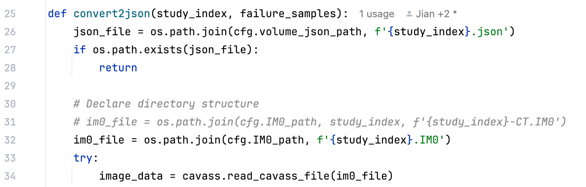
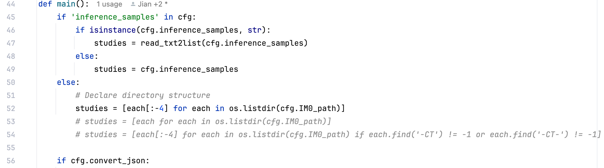
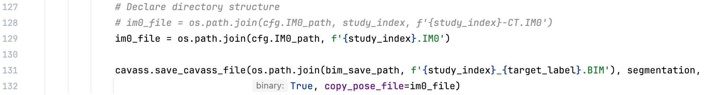

# Segmentation Instruction 

[toc]

## Inference

Install dependencies

The requirements.txt file is in the workspace directory.

```
pip install -r requirements.txt
```

Please manually install torch, torchvision based on your device.
And If necessary dependencies are missed in ``requirements.txt``. Please let me know.

Run infer.py

```
python -u infer.py --cfg config.toml
```

### Command line config items

The config items are listed as follows.

```
parser.add_argument('--owner', type=str, default='Dai Jian')
parser.add_argument('--cfg', type=str, default=None)
parser.add_argument('--cfgs', type=str, nargs='+', default=None)
parser.add_argument('--gpus', '-g', type=str, nargs='+', default=None)
```

The first one ``--owner`` is used to indicate the user of the process, really useless for the script.

``--cfg`` is necessary for running the script to indicate the TOML format config file.

``--gpus`` indicates the GPU used for running, you can also assign the GPU in the TOML file described later.

### TOML config file

The TOML format config file is necessary for running the script.

Here is an example config file for inference.

```
gpus = ['0']

batch_size = 50

IM0_dir = '/home/ubuntu/sdb/dj/tmp/CTs'
volume_json_dir = '/home/ubuntu/sdb/dj/tmp/JSONs'
output_cavass_dir = '/home/ubuntu/sdb/dj/tmp/Segmentation_CAVASS'

# You need to convert image format to JSON format for processing.
# You can set this to false if you already performed the converting.
# And don't worry about the redundant conversion, only image files without JSON format would be converted.
convert_json = true

# Declare the labels that need to be inferred.
inference_labels = ['SAT_wb', 'VAT_wb', 'SMT_wb', 'Sk_wb']

# The following contents define the pre-trained weights for each class.
pretrained_model_zoo = '/home/ubuntu/sdb/dj/bca_pretrained'

# Syntax ${arg} means referencing variable arg.
# This is not a standard TOML language syntax. I just implemented this for convenience.
[labels.SAT_wb]
# Declare the network class.
# The definition of model class is in ~/models/__init__.py
model = 'ganet'
pretrained_weights = '${pretrained_model_zoo}/SAT_whole_body/SAT_ganet_wb.pt'
network_config = '${pretrained_model_zoo}/SAT_whole_body/network_config.toml'
data_property = '${pretrained_model_zoo}/SAT_whole_body/data_property.json'
batch_size = 80

[labels.VAT_wb]
model = 'ganet'
pretrained_weights = '${pretrained_model_zoo}/VAT_whole_body/VAT_ganet_wb.pt'
network_config = '${pretrained_model_zoo}/VAT_whole_body/network_config.toml'
data_property = '${pretrained_model_zoo}/VAT_whole_body/data_property.json'
batch_size = 80

[labels.SMT_wb]
model = 'ganet'
pretrained_weights = '${pretrained_model_zoo}/SMT_whole_body/SMT_ganet_wb.pt'
network_config = '${pretrained_model_zoo}/SMT_whole_body/network_config.toml'
data_property = '${pretrained_model_zoo}/SMT_whole_body/data_property.json'
batch_size = 80

[labels.Sk_wb]
model = 'ganet'
pretrained_weights = '${pretrained_model_zoo}/Sk_whole_body/Sk_ganet_wb.pt'
network_config = '${pretrained_model_zoo}/Sk_whole_body/network_config.toml'
data_property = '${pretrained_model_zoo}/Sk_whole_body/data_property.json'
batch_size = 80

[labels.IAM]
model = 'unet_plus_plus'
pretrained_weights = '${pretrained_model_zoo}/IAM_UNet++.pt'
post_process = ['keeping_largest_region', ]

[labels.OAM]
model = 'unet_plus_plus'
pretrained_weights = '${pretrained_model_zoo}/OAM_UNet++.pt'
post_process = ['keeping_largest_region', 'filling']

[labels.Skn]
model = 'unet_plus_plus'
pretrained_weights = '${pretrained_model_zoo}/Skn/Skn_unet++.pt'
network_config = '${pretrained_model_zoo}/Skn/network_config.toml'
data_property = '${pretrained_model_zoo}/Skn/data_property.json'
post_process = ['keeping_largest_region', 'filling']
```

### Declare the inference samples

There are three ways to declare the images that need to be segmented.

1. Include the sample files (or sample index) in a txt file and declare the txt file in the toml config file with the key of ``inference_samples``.
2. Or directly set a list of samples to ``inference_samples`` in the toml config file.
3. If ``inference_samples`` is not provided in the toml config file, all subjects in the directory declared in the toml config file with the key of ``IM0_dir`` will be segmented.

### Declare the dataset directory structure

The following **directory structure** code in **infer.py** may need to be changed to ensure that the image file can be
found correctly.

*Function ``convert2json``*



*Function ``main``*

**To find the inference samples.**



**To save the output segmentation.**


